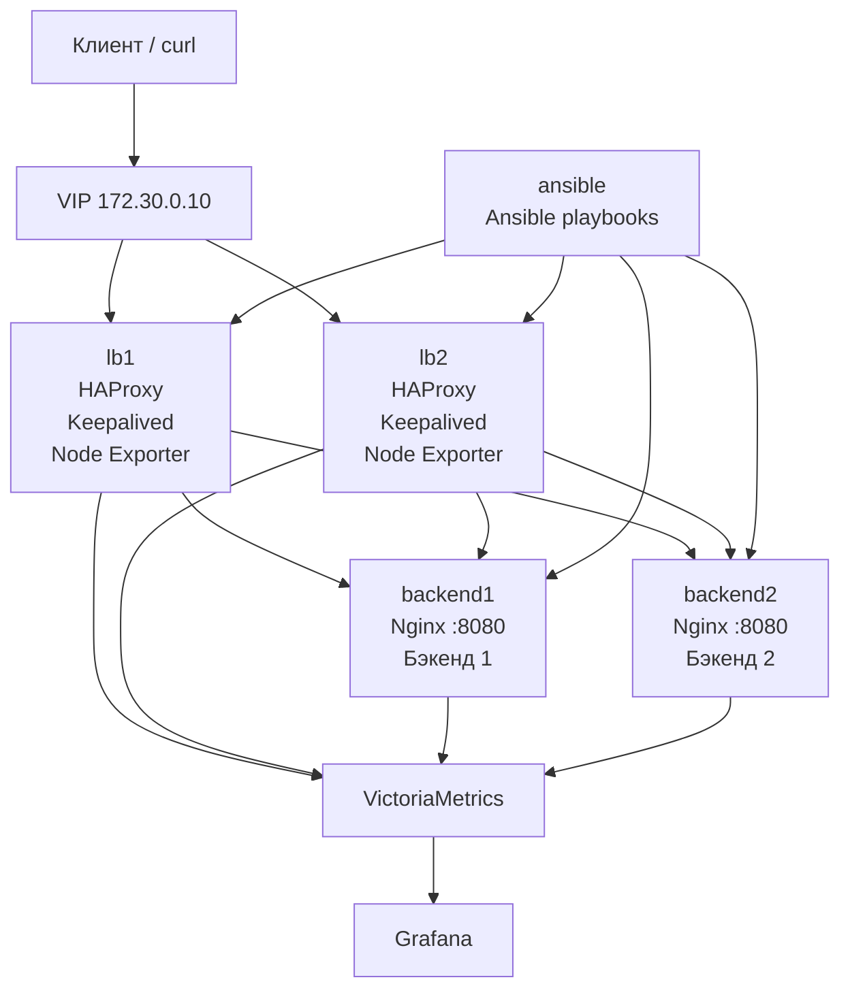

# Отказоустойчивая система с Ansible, HAProxy, Keepalived, VictoriaMetrics и Grafana

Проект поднимает изолированный стенд из 7 контейнеров:

- `lb1`, `lb2` - два балансировщика на Debian
- `backend1`, `backend2` - два backend-узла на Debian
- `ansible` - контейнер автоматизации с Ansible
- `victoriametrics` - хранилище и сборщик метрик
- `grafana` - визуализация метрик

`docker compose up` поднимает только подготовленную среду: SSH-доступ, сеть, IP-адреса и monitoring-контейнеры. Установка HAProxy, Keepalived, Nginx и exporters выполняется отдельными Ansible-плейбуками, как требуется в ТЗ.

## Используемые версии

- Debian base image: `bookworm-slim`
- Grafana: `12.4.1`
- VictoriaMetrics: `v1.138.0`
- HAProxy, Keepalived, Nginx, Ansible и Node Exporter устанавливаются из актуального репозитория Debian Bookworm на момент сборки контейнеров

## Архитектура

- Docker-сеть: `172.30.0.0/24`
- VIP балансировщиков: `172.30.0.10`
- `lb1`: `172.30.0.11`
- `lb2`: `172.30.0.12`
- `backend1`: `172.30.0.21`
- `backend2`: `172.30.0.22`
- `ansible`: `172.30.0.30`
- `victoriametrics`: `172.30.0.40`
- `grafana`: `172.30.0.41`

Балансировка выполнена на HAProxy, отказоустойчивость - на Keepalived по схеме active/backup, backend-ответы - через Nginx на порту `8080`, инфраструктурные метрики - через `prometheus-node-exporter`, метрики VIP - через textfile collector на LB-нодах.

### Схема проекта



### Что такое VIP

VIP, или Virtual IP, это виртуальный IP-адрес, который не закреплен навсегда за одним контейнером.

В этом проекте:

- `lb1` имеет обычный IP `172.30.0.11`
- `lb2` имеет обычный IP `172.30.0.12`
- `172.30.0.10` это общий адрес балансировщиков

Смысл VIP такой:

- клиент всегда обращается к одному и тому же адресу `172.30.0.10`
- `keepalived` решает, на каком LB сейчас должен висеть этот адрес
- если активный `lb1` падает, VIP переезжает на `lb2`
- для клиента адрес не меняется, сервис остается доступным

То есть VIP это "плавающий" адрес входа в систему.

Если совсем просто:

- без VIP клиенту пришлось бы знать, идти на `lb1` или на `lb2`
- с VIP клиент знает только один адрес, а система сама решает, кто сейчас активный

## Запуск окружения

Перед первым запуском подготовьте локальные каталоги для данных monitoring-сервисов:

```bash
mkdir -p volumes/grafana/data
mkdir -p volumes/victoriametrics/data
mkdir -p monitoring/victoriametrics
```

Поднимайте окружение:

```bash
docker compose up -d --build
docker ps
```

## Доступ в контейнер Ansible

```bash
docker exec -it ansible /bin/bash
cd /ansible
ls -l /tmp/ansible_key
```

## Запуск плейбуков

Рекомендуемый порядок:

```bash
ansible-playbook playbook_backend.yml
ansible-playbook playbook_lb.yml
ansible-playbook playbook_cluster.yml
ansible-playbook playbook_metrics.yml
ansible-playbook playbook_monitoring.yml
```

## Что настраивают плейбуки

- `playbook_backend.yml`:
  разворачивает backend-страницы и Nginx на `backend1`/`backend2`
- `playbook_lb.yml`:
  устанавливает и настраивает HAProxy на `lb1`/`lb2`
- `playbook_cluster.yml`:
  устанавливает Keepalived, поднимает VIP `172.30.0.10`
- `playbook_metrics.yml`:
  ставит node exporter на все узлы и публикует метрику владельца VIP
- `playbook_monitoring.yml`:
  генерирует конфиг scrape для VictoriaMetrics, создает datasource Grafana и импортирует dashboard

## Проверка балансировки

На Docker Desktop VIP удобнее проверять изнутри docker-сети, например из контейнера `ansible`:

```bash
docker exec ansible curl http://172.30.0.10
docker exec ansible curl http://172.30.0.10
docker exec ansible curl http://172.30.0.10
```

В ответе будет HTML со строкой `Бэкенд 1` или `Бэкенд 2`.

## Проверка отказоустойчивости

Определить текущего владельца VIP:

```bash
docker exec lb1 ip addr show eth0
docker exec lb2 ip addr show eth0
```

Остановить активную ноду:

```bash
docker stop lb1
```

Проверить, что VIP ушел на `lb2`, а сервис доступен:

```bash
docker exec ansible curl http://172.30.0.10
docker exec lb2 ip addr show eth0
```

Чтобы вернуть контейнер:

```bash
docker start lb1
```

## Мониторинг

- Grafana: [http://localhost:3000](http://localhost:3000)
- Логин / пароль: `admin` / `admin`
- VictoriaMetrics API: [http://localhost:8428](http://localhost:8428)

После выполнения `playbook_monitoring.yml` в Grafana автоматически появляется dashboard `HA Platform Overview` со следующими панелями:

- статус `lb1` и `lb2`
- доступность `backend1` и `backend2`
- текущий владелец VIP
- CPU по всем узлам
- использование RAM
- сетевой трафик
- HTTP status codes с балансировщиков

## Полезные команды

Проверить scrape-метрики HAProxy:

```bash
docker exec ansible curl http://lb1:8404/metrics | head
```

Проверить node exporter:

```bash
docker exec ansible curl http://backend1:9100/metrics | head
```


Проверить datasource и dashboard через Grafana UI:

1. Открыть `http://localhost:3000`
2. Войти под `admin/admin`
3. Открыть `Explore` и выбрать datasource `VictoriaMetrics`
4. Открыть dashboard `HA Platform Overview`

## Структура проекта

```text
.
├── backend1/
├── backend2/
├── ansible/
├── docs/
├── lb1/
├── lb2/
├── images/debian-ssh/
├── monitoring/
├── ssh/
├── docker-compose.yml
└── README.md
```
